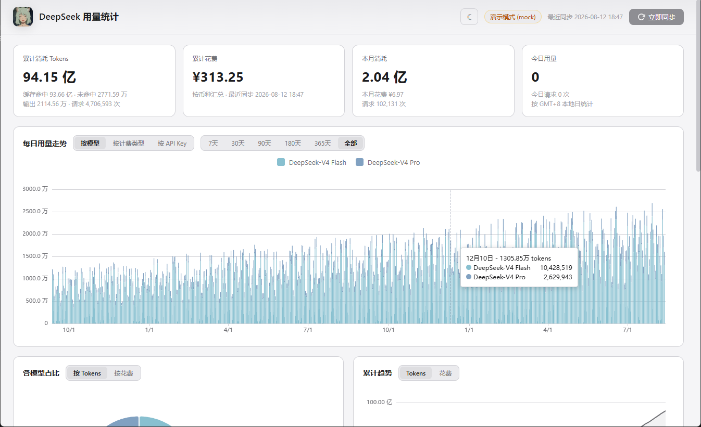
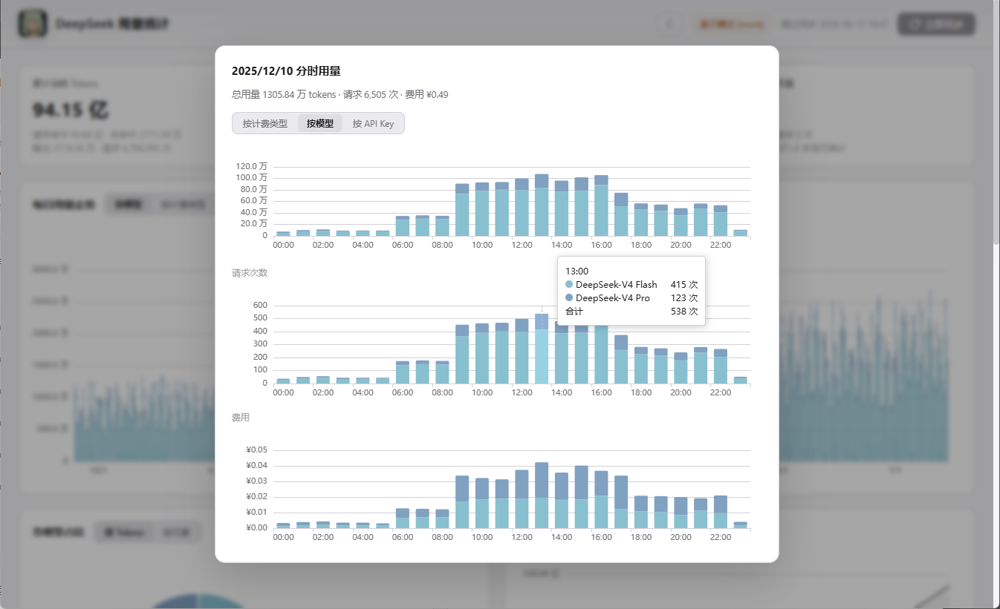
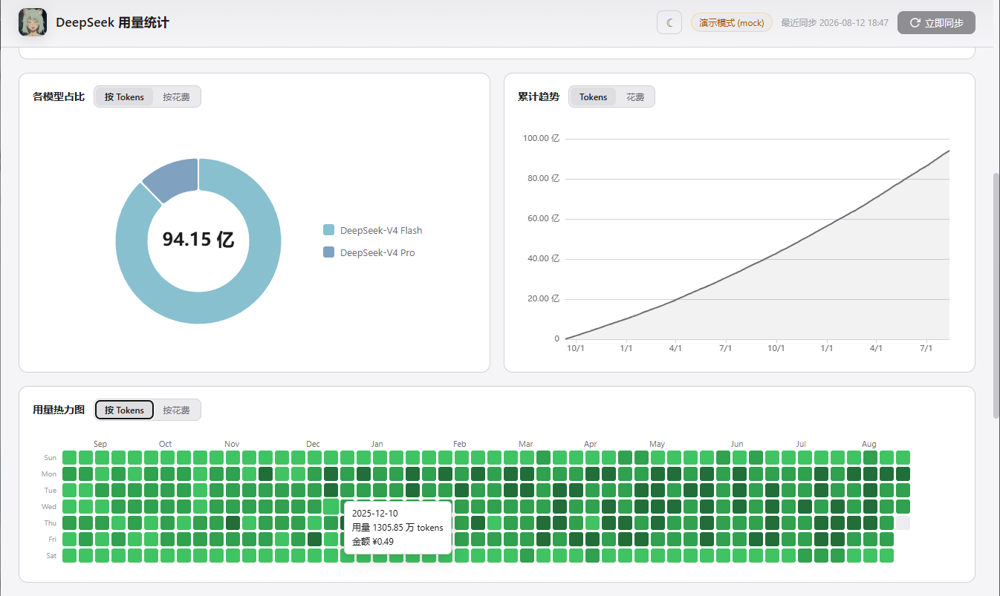
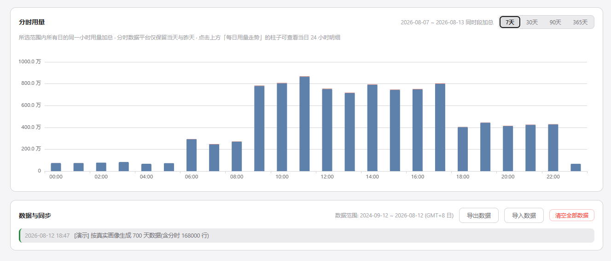

# DeepSeek API 用量统计
由于deepseek官网查询api用量的范围只能选30天，分时用量只能查询最近两天，

制作了本地化的 DeepSeek API 用量与费用统计面板，将api用量信息保存并做了可视化。

> 数据全部保存在本地 SQLite 数据库中，仅向 deepseek.com 官方域名发起请求；登录凭证只用于拉取你自己的用量数据。

## 功能特性

- **每日用量走势**：按模型 / 按计费类型 / 按 API Key 堆叠，

  点击柱状图弹出当日 24 小时分时明细（tokens 拆分堆叠 + 请求次数折线 + 每小时费用）

  官网分时用量只能查询今天和昨天，通过每天从官网拉取分时用量并保存在本地
  

- **数据可视化**
- **数据导出与导入**

统计一天中的哪个时段调用api最多，方便看不同时段定价策略

### 启动
Python 3.10+

pip install -r requirements.txt

> 桌面窗口需要 Microsoft Edge WebView2 运行时

start.bat 启动

start-mock.bat 以演示模式启动

## 免责声明

本项目为非官方工具，通过 DeepSeek 开放平台的前端私有接口获取数据。这些接口没有公开文档、可能随时变动，项目无法保证长期有效。

请仅用于本人账号的数据统计，遵守平台服务条款。
